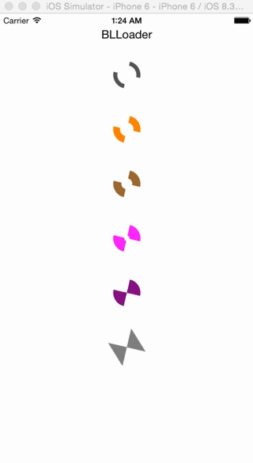

# BLLoader
Simple, easy to use and customisable loading indicator (loader) for iOS applications.

## Screenshots



## Usage

### Basic usage

Add BLLoader class into your project.

```objective-c
#import "ViewController.h"
#import "BLLoader.h"

@interface ViewController()

@property (weak, nonatomic) IBOutlet BLLoader *loader;

@end
```

```objective-c
@implementation ViewController

- (void)viewDidLoad {
    [super viewDidLoad];
    
    // Set custom lineWidth or don't set to use default lineWidth
    _loader.lineWidth = 10.0;
    
    // Set custom color or don't set to use default color 
    _loader.color = [UIColor grayColor];
    
    [_loader startAnimation];
}

- (void)doSomething
{    
    [_loader startAnimation];
    [XYZService fetchSomeData:^(){
        [_loader stopAnimation];
    }];
}
```

## Requirements

- iOS 7 or higher
- Automatic Reference Counting (ARC)

## Author

- [Babulal Poonia](https://github.com/BLPoonia) ([@_iambabu](https://twitter.com/_iambabu))

## License

BLMultiColorLoader is released under the MIT license. See the LICENSE file for more info.
